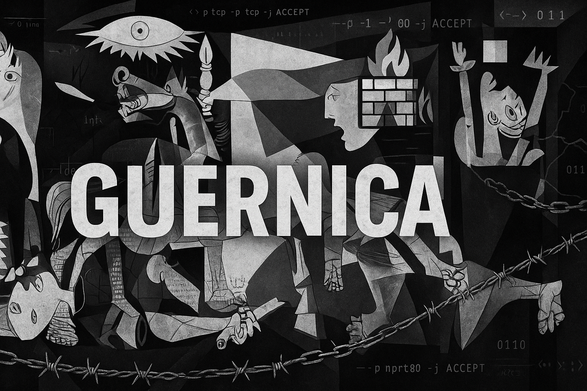

  

<h1 align="center">Guernica</h1>

<em>Advanced iptables configuration analyzer with security risk detection and chaos index calculation</em>

---

## Overview

**Guernica** is an analysis tool designed for security professionals to detect and understand changes in `iptables` firewall configurations.  
  
Inspired by Picasso’s iconic painting symbolizing turmoil, Guernica reveals the hidden risks in rule modifications and quantifies their impact through a unique metric : the **Chaos Index**.  
  
It turns complex differences into clear visual information, helping you spot dangerous changes in your firewall configurations before they become vulnerabilities in your information systems.

---

## How It Works

Guernica processes two iptables configuration files (`.txt`, `.rules`, or `.iptables`) and follows these steps :

1. **Load Configs** – Validates baseline and modified files  
2. **Normalize** – Fixes common syntax issues  
3. **Compare** – Detects added, removed, or changed rules  
4. **Analyze** – Flags risky ports and patterns  
5. **Calculate** – Computes the Chaos Index  
6. **Visualize** – Generates charts and metrics  
7. **Report** – Outputs in terminal, HTML, or plain text

---

## Features

### Security Risk Detection

Identifies :

- Critical ports (SSH, HTTP, DNS, databases, etc.)
- Wide-open port ranges
- Permissive rules (e.g., unfiltered `INPUT`/`FORWARD`)
- Changes to connection state rules
- Suspicious source IP modifications

### Rule Grouping

Organizes changes by :

- Port number (e.g., all changes affecting port 80)
- Chain type (`INPUT`, `OUTPUT`, `FORWARD`)
- Rule purpose (based on pattern recognition)

---

## Chaos Index

A 0–100 metric that quantifies disruption introduced by rule changes.

**Formula** :  

`Chaos Index = min(100, (raw_score / adaptive_max) * 100)`  
  - `raw_score = (additions × 1.5) + (removals × 1.0)`
  - `adaptive_max = max(50, min(200, total_lines / 2))`

> Additions are more heavily weighted as they potentially expand the attack surface.

### Interpretation

| Score      | Assessment | Description                                              |
|------------|------------|----------------------------------------------------------|
| 0–25       | Low        | Minimal changes with limited security impact            |
| 25–50      | Moderate   | Significant changes requiring attention                 |
| 50–75      | High       | Major reconfiguration with potential security concerns  |
| 75–100     | Extreme    | Complete overhaul with high security risk               |

---

## Visual Analysis

Guernica generates :

- Bar charts : Additions vs. Removals
- Chain-specific distribution charts
- Chaos Index gauge with color-coded thresholds

---

## Advanced Processing

- **Normalization** : Auto-fixes common iptables syntax errors
- **Validation** : Confirms file format correctness
- **Flexible Formats** : Supports various iptables output styles

---

## Usage

- Basic analysis  
`python guernica.py --before baseline.rules --after current.rules`

- Export reports  
`python guernica.py -b baseline.rules -a current.rules -e report.html -o report.txt`

- Skip normalization  
`python guernica.py -b baseline.rules -a current.rules --no-normalize`

- Skip charts  
`python guernica.py -b baseline.rules -a current.rules --no-visualization`
---
Feel free to modify and use this code as you wish :)
